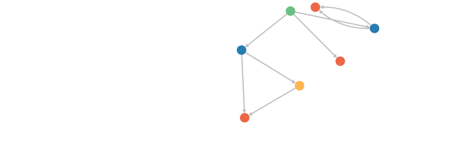

# Graph Studio (Oracle) for Parallel Graph AnalytiX (PGX)

```sql
%java-pgx
var graph = session.getGraph("MY_FIRST_GRAPH")
```

```sql
%java-pgx
    var graph = session.getGraph("MY_FIRST_GRAPH")
    analyst.countTriangles(graph, true)
```

```sql
%pgql-pgx
select v, e from match (v)-[e]->() on MY_FIRST_GRAPH
```



```sql
%pgql-pgx
select c.NAME, c.POPULATION from match (c:City) on MY_FIRST_GRAPH order by c.POPULATION desc
```

