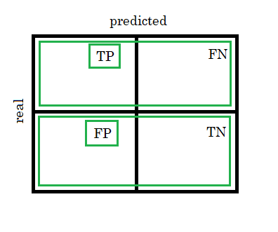

# Notes

Remember the Confusion Matrix:

and if we compute:

so that our Y axis is the **sensitivity** and **specificity** the X axis. But, specificity starts from 1 - 0, so we compute the **FPR (1-specificity)** to have 0-1 in Y axis and 0-1 in X axis for the ROC plot. If we take the last time example, where the confusion matrix was:

*Note: the '0' does not mean 'negative' in the axes, but 'class 0 (positive)' and '1' is 'class 1 (negative)'.*

Taking both the TPR and FPR for Y and X axis we get:

This given point (FPR, TPR) is **on** the ROC Curve, but how do we get the remaining points on it? For example if our data is a):

And then, in the ordered table b) we put a **decision threshold** that divides the 0's from the 1's in the real data vector, we would get what we got as TPR and FPR. If we **move** the threshold, say to rows up like c), then **change the real 0's to 1's**, then calculate again the **TPR and FPR**  with a new confusion matrix ([[5, 1], [1, 1]]) and put another **point** in (FPR, TPR), and so on until the threshold has visited all rows, we will get the ROC Curve plotted.

It's the same idea when we plot the NO and YES and have the ideal threshold:

We say ideal threshold because we have 50% and 50% on both sides of the threshold, that is, we have balanced entries for class 0 and class 1. The closer our NO and YES outcomes are from each other, the harder the prediction will be, and the closer the ROC curve will be from the AUC = 0.5 or less.

The following images show how the TPR and FPR change as the threshold moves.

Thus, by looking at our first point in (0.46, 0.91), where the real threshold starts, we can say that it looks like the second picture where there are More Positives' Entries, meaning that the database must have more positive class entries than negative ones: this positioning of the starting threshold lets us know which class our classifier is able to predict better. Ideally, the point should be more towards the center of the corner: it can differentiate the two classes.