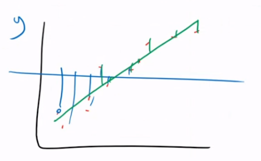

# Metric for Linear Regression Problems

A linear regression problem consists of a linear model that estimates the tendency of the data. In the following image, a uni-variate linear regression problem is shown:

Earlier during classification model's metrics, we could measure the accuracy of the model with the output prediction. This time, we need other techniques to evaluate how *good* a linera regression model is, since the line is an **estimation** of the overall tendency in the data.

### 1. Mean Absolute Error

The simplest metric is called **Mean Absolute Error**, and this metric measures the distances between the points of the training data and the final model line. Distances are absolute values, so there is no sign in the calculated values of the metric, and at the end this sum of distances is divided by the total number of points.

This metric basically gives you the average distance of the points to the line. Again, since it is a mean calculation, atypical points that are very far from the line affect more the sum that small distances.

There is no range, but the closest the MAE is, the better your model is.

### 2. Mean Squared Error

There is other technique called **Mean Squared Error**, where the distances to the model are squared in the sum factors to exaggerate bigger differences with the model more than small differences.

^2}})

### 3. R Squared

R-Squared is an statistical measure of how close are the training points from the adjusted line. It is also known as **determination coefficient** or **multiple determination coefficient** in the case of multi-variate linear regression.

Its definition: it is the percentage of variance in the output variable of a linear model.

R Squared = Explained Variation / Total Variation

)^2}-\sum^m_{i=1}{(y^i-h_a(x^i))^2}}{\sum^m_{i=1}{(y^i-\mu(y))^2}})

where:

)^2}=variance)

This variance is with respect to **y axis**, where each point will add to a variance based on the dispersion of said point to the y axis mean:

Then, the other term in the equation is just the error with the model: the variation of the points with respect to the model, much like the absolute error:

This value will always be in the range of 0-100%:

- 0% indicates that the model does not explain any portion of variability in the output data with respect to their mean.

- 100% indicates that the model explains all variability in the output data with respect to their mean.

In general, the bigger the R Squared value is, the better adjusted the model is to the training data: the closer to 100 the better. This measure tells us how adjusted is the model to the data. Also, if you have a model done according to highly correlated data, it is more probable that the R Squared will be closer to 100%.

## Feature Extraction

This would be testing each attribute of a data set to see how this feature influences the model we are implementing. This techniques are aid by the computation of a Correlation Matrix.

We mentioned that if an attribute has a strong correlation with the target column (diagnosis, price, etc), said attribute brings important information to predict such target column. But also we mentioned that those attributes that are strongly correlated between each other bring up the **same** information, being redundant, and thus we can delete one of the two in a correlated pair ( the one that in return has less correlation to the target), in order to reduce dimensions of the data set.

Reducing a bit the dimensions of the data set is important because they increase the computation time and also decrease our ability to plot the final model: a multivariate model with more than 3 features cannot be plotted, for example. But a problem arises: so if we delete all of them and I keep two features, my model is perfect, but is it correct? So how many attributes should we keep?

Now, the first thing to do is to have in mind all the attributes that are highly correlated to the target column or to each other: we need a **threshold** to know which attributes are highly correlated with each other or with the target itself, and thus we transform all correlation values to absolute values.