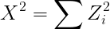

# Feature Extraction

## Chi Square

Feature Extraction is the process of determining which attributes of a data set bring important information for the prediction model. One of the ways for giving a score or a ranking to the attributes is using the **Chi Square** score, which is an *statistical technique* for Feature Extraction.

### Chi Square Distribution

A random variable X follows chi-square distribution if it can be written as a sum of squared standard normal variables.

The *degrees of freedom* is basically the sample size - 1. We can also observe that as the degrees of freedom increase Chi-Square distribution approximates to normal distribution.

### Chi-Square Test for Feature Selection

A chi-square test is used in statistics to test the independence of two events. Given the data of two variables, we can get observed count O and expected count E. Chi-Square measures how expected count E and observed count O deviates each other.

In feature selection, we aim to **select the features which are highly dependent on the response**.

- When two features are **independent**, the observed count is close to the expected count, thus we will have **smaller Chi-Square value**. So high Chi-Square value indicates that the hypothesis of independence is incorrect. 

- The **higher the Chi-Square** value, the **feature is more dependent** on the response and it can be selected for model training.

## Feature Selection With SelectKBest

Thus, we will use the value of Chi Squared to select the K more dependent attributes to the response outcome. Thus, the fitting of the chi squared compares each attribute with the target class and gives it a score, in order to finally choose th k highest chi scored attributes.

Sometimes, the lower the k, the lower the accuracy or model score is. That is due to the fact that the combination of columns might increase the model's ability of prediction: the interaction of columns makes a more robust model. But there is a k maximum number from which the model is not more robust, and thus decreases the accuracy. It is still an empiric decision of how many values to choose for k. 

When we have the k best attributes, we can cut the data set and perform a division by percentage test to see the accuracy with the best columns.

## Recursive Feature Elimination

This is not an statistical tehcnique, but a mathematical model to choose the important attributes. The RFE method takes out columns and tests with the remains using a mathematical model (in this case Logistic Regression) to get an accuracy, and so on until the important attributes are detected. Thus, depending on which model gets the highest accuracy using the remaining columns during an RFE test, it will give a ranking to the columns. 

The ranking is related to the parameter `n_features_to_select`, in the sense that it will output the n highest columns as 1's, because those n features together generate a more accurate model. If the model with the best ranked columns gets a similar accuracy than without the RFE, we can confidently take out the lower ranked columns, because that is showing that no significant change is done with the lower rank columns. Thus, we need to take care of how many features the model starts to lower the accuracy.

## Encoders

We then proceed to change categorical columns to numbers with Python's Encoders, to see if the accuracy gets better. The important is to check with how many attributes the accuracy starts to lower, or if the method lowers it, or the encoding. It is interesting to see if the RFE and chi squared is choosing the same attributes.

