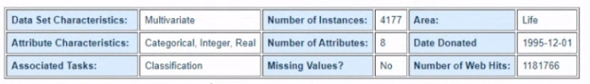
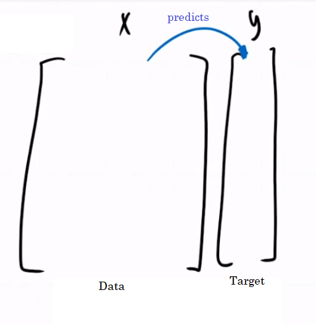
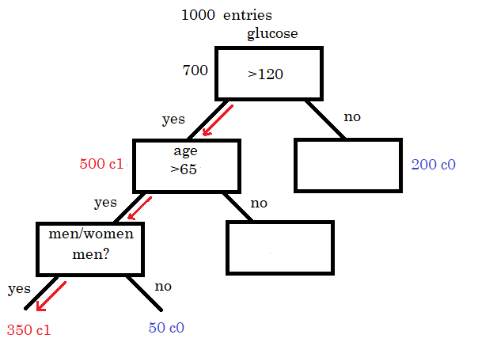
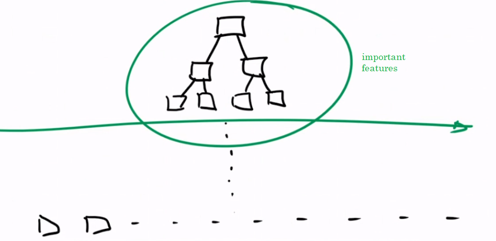
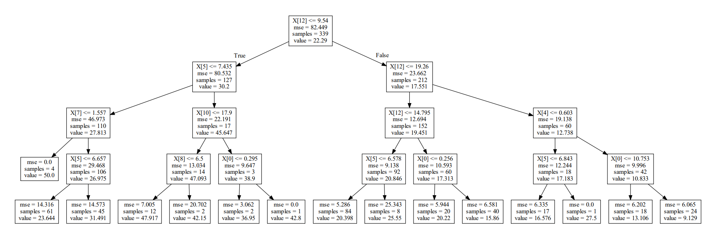

# Binary Encoding

When we have a categorical column that is not the target column for a classification problem, we can convert the string categories in said column into N binary columns: in this example, we have a column that tells us the Sex of an oyster can either be (M)ale, (F)emale or (I)nfant:

| 0 | 1 | ... |
| --- | --- | --- |
| M | ... | ... |
| M | ... | ... |
| F | ... | ... |
| M | ... | ... |
| I | ... | ... |

Since we have 3 categories in this column, we need to encode it into 3 binary columns:

| 0 | 1 | 2 |
| --- | --- | --- |
| 0 | 0 | 1 |
| 0 | 0 | 1 |
| 1 | 0 | 0 |
| 0 | 0 | 1 |
| 0 | 1 | 0 |

Python uses the alphabetical order of: F, I, M and thus the column 0 is 1 when the oyster is F, column 1 is 1 when the oyster is I and column 2 is 1 when the oyster is M. In this way, our model can take these three columns as part of the training set, instead of dropping all the categorical columns as we did before.

In this data set, the accuracy with a resampling validation technique if we ignore the categorical column is 24% and if we include it binarized in three columns, the accuracy improves to 25%, which means the categorical column bring information that improves the prediction model.

The low percentage in the accuracy might indicate that Logistic Regression is not the best algorithm for the classification problem in this data set.

# Decision Trees

This is usually the model we have been relying on:

The **Decision Tree** algorithm is useful too for prediction algorithms such as the ones for Classification (discrete category) and Regression (float number). The tree is formed by nodes (squares) and branches. Each node represents the rule that the following branches will follow, and which nodes are consequence of that node value.

In a classification problem, how would it work? We now that each of the columns in the data matrix is important information for the target prediction. However, there exists a **ranking** of which columns are the most useful or key for the prediction, as we saw before with the chi square and R square techniques. The **Decision Tree** chooses the most useful attributes to begin and continue the tree levels.

For example, in an example of predicting whether or not a patient has diabetes. We know that the most important attribute to predict this is the *glucose* column, thus the root of the tree or the first node is a glucose value. From there, the algorithm declares a **threshold** of said column to separate the ranges that generate a YES or NO. Thus, from our 1000 entries, 700 have a glucose > 120, and *inside* those 700, 500 are class 0 (NO DIABETES) and 200 are class 1 (YES DIABETES).

Now, let's say the second most important feature is *age*, and we also define a threshold for the age depending on the 500 entries that we have from the node of glucose. Say the threshold for age is 65, and thus from those 500 that have glucose > 120 and age > 65, we have that 400 are class 1 (YES) and 100 class 0 (NO). In this way we have another tree branches and nodes. That is how branches are created, on and on. You cannot put a node that contradicts the prediction of the parent node, you would need to put it as a child of another node.

Thus, when we have a new data point as input, we will define the position of the point according to all these attributes, and the arrowed line is the way that a YES (class 1) data point follows. This is a joint-attribute probability tree: the end of a leaf is the way a series of attributes help each other narrow the classification for a point. The more atributes the tree has, the bigger the tree is and thus the computational power needed for finding all the possible ways in the tree. That's why there are techniques for cutting the tree and keep the important features. Therefore, the tree algorithm also helps for important feature selection.

In Python, the node's first row is the question that represents the threshold, in this case 9.54. 339 samples enter the condition. Each level reduces the mse. The nodes are repeated because with this the samples are narrowed to subgroups of values of the same column that are more relevant the smaller or deeper they get.

## Handy Links

- https://stackoverflow.com/questions/35064304/runtimeerror-make-sure-the-graphviz-executables-are-on-your-systems-path-aft