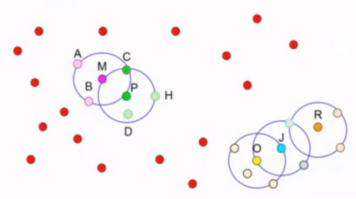

# Non-Supervised Learning: Clustering

- Supervised: when the class of a data point is known for all the points in the data set, and thus the training builds a model around these.

- Non-supervised: the class or group is not known, and thus the algorithm produces output groups based on adjustable parameters related to data's similarity or differences. One technique is **clustering**, and this has also different techniques.

One of the features used for grouping data is using the **distance** of the data points: where the distance is very short among certain points, we can have a group; but also the larger distance between sets of data suggests the existence of several groups as well.

## Clustering (Grouping)

Consists in dividing a set of heterogeneous elements in **clusters** or **homogeneous groups**. It is considered as a non-supervised classification paradigm, since it assigns a class to each element (cluster it belongs to), but said classes are not known during the learning process of the model.

The objective of clustering is to find a division in the data in which there is:

- **High intra-cluster similarity**: similarity between the elements of the same cluster must be high.

- **Low inter-cluster similarity**: similarity between the elements of different cluster must be low.

The similarity is usually based on a measure of **distance**. This measure depends on the data representation (numeric, discrete, boolean, etc).

### Examples: Applications

- Biology: detection and grouping of similar gene sequences.

- Marketing: discovery of client groups for discount offerings, etc.

- Social Network Analysis: community detection.

- Information Search: grouping of news or documents that are similar.

## Clustering Methods

- Centroid Based

    - **k-means**

    - k-medoids

- Hierarchical

    - Diana

    - Agnes

    - **BIRCH**

    - ROCK

- Density-based methods

    - **DBSCAN**

    - OPTICS

## K-means

Might be the most used algorithm of clustering, and it implies assigning examples to the effort groups, in an effort to minimize the variation inside each group. The objective is to describe a process to divide an N-dimensional population in k sets over the base of a sample.

A disadvantage could be that we need to give it a parameter *k* of how many clusters we want to divide in.

- Example: k = 3 (three groups):

First we randomly generate 3 points in the cartesian space, and these will be our centroids.

For each point we will measure the distance between itself and the three centroids, and the point will belong to the cluster of the centroid that measure the smallest distance. In the end, all points will belong to one centroid cluster.

In the second iteration, the objective will be to minimize the distance of the centroid to all its points, so that the centroid is more so in a centered position of its point. This is done iteratively until the algorithm converges (centroids do not move anymore). Due to the randomness, we can fall into a stale process and result in strange clusters.

### Pseudocode

- Example:

- K-means does not work very well when data set has a lot of noise data.

- It is not adecuate either for data sets in which the clusters or original groups present some characteristics:

    - Different sizes.

    - Different densities (some clusters are more compact and others more spread out).

    - Non-globular shape. (non-circular shape).

- Example: image segmentation

## Hierarchical Clustering

- This clustering does not need a priori fixed number of clusters (no k).

- Progressively unifies the two closest clusters into one.

- It is required to use a similarity measure to determine which clusters can be separated/fused in each step. Given two clusters, this distance can be:

    - Minimum distance between a cluster element and another cluster element.

    - Maximum distance between a cluster element and another cluster element.

    - Distance between the centroids of the clusters.

### Process

We start from as many clusters as the number of elements in the training set. In this case 5. We then start to unify the points based on the ones that have the closest distance.

In each step we unify the pair of clusters that are closest to each other and thus the number of clusters is reduced. We make also another plot where in the x axis we put the coordinates and in y axis the distance. To measure the distance, the centroid of cluster points is calculated.

This process is the dendogram.

In this technique, there can be two stop criteria: 

- A **distance threshold**.

- **Number of clusters**.

One of the advantages of this method is that we can perform a cluster analysis post-process. An example of an application is **the filogenetic tree**.

## Density Based Clustering

- Method based on distance

- Method based on conectivity

## Density Based Clustering: DBSCAN

- Algorithm that generates clusters based on the idea of connection by density.

- Useful when the clusters have irregular shapes, they are intertwined or there is noise in the data.

- Parameters:

    - Epsilon: radius R

    - n: Number of neighbours

Given a set of points, we grab one randomly. Then, we build a circle of radius E centered in the point we grabbed and then we count the neighbours inside that circle (the center point does not count). If we have at **least N neighbours**, we name this as a **core object**. The idea is to find how many core objects we have in the plane.

Thus, we start the algorithm by finding all points that are **core objects**. In this case, M, P, O, J and R are core objects.

-  An object H is directly reachable (d.a.) by density from another object O, if H is in the neighbourhood, R, of O and O is a core object.

- An object S is indirectly reachable by density from other object O, if there exists a sequence of objects (p_1, p_2, ..., p_n) in which p_i is directly reachable from p_i-1. Also, p_1 = O and p_n = S. Like the image below.

- An object S is connected by density with another object P if there exists an object H with which S and P are indirectly reachable from H. For example, S is connected by density with P from H.

Thus, we attach the directly reachable:

We connect O, J, R by density:

We analyse the points in the edges of the core objects, if they are core objects we can continue joining. But, if a point is not a core object we cannot join anymore core objects from that point as center, since it is not a core object. At the end of this example, we only got two clusters, and the remaining points are **outliers** or noise, because they do not belong to any group. In k-means, all points end up belonging to one cluster, for example.

