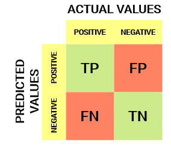
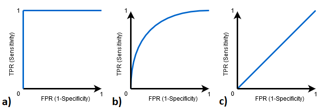

# Where Does The Accuracy Comes From?

A database that has 4 columns is more likely to produce a higher accuracy in prediction than a database with 1000 columns. This is due to the fact that in the DB that has 4 columns, each column has 25% of the total weight on the algorithm's information that predicts an output, for example.

When we have this type of DB, what is more recommended is to drop the columns that are strongly correlated with the class to see how the result of accuracy decreases to a less 'perfect' answer.

The **accuracy** we have been using as a metric only tells us if the final prediction is the same as the expected (known) output of a binary classification problem. There are other metrics that tells us how good is our algorithm with respect to each of the classes, in a separate way.

This is helpful when for example we have a database that has 90% of the entries belonging to class 0 and only 10% belonging to class 1: this metric will tell you how good is the algorithm for the prediction of each class. In that case, we would notice that the percentage of accuracy for the prediction of class 0 is very high compared to the accuracy for class 1, for example, and there we would notice a fault in our database: inbalance.

## Confusion Matrix

This matrix is done to calculate and compute how many concordance can there be between two or more points of view, or classes in this case. You can apply this metric to evaluate any Resampling Method. The matrix will have a size of n x n where n is the number of classes. In this case, for binary classification the matrix will be a 2x2 matrix.

In the case of a predictive model like binary classification, we would have an output as follows:

| Prediction | Real |
| ---- | ---- |
| 1 | 1 |
| 0 | 0 |
| 1 | 0 |
| 0 | 1 |
| 0 | 0 |
| 1 | 1 |
| 1 | 0 |
| 0 | 1 |
| 1 | 1 |

And the confusion matrix would be:


If we take on account that:

- 1 -> True/Positive Value

- 0 -> False/Negative Value

We assign a name to each cell of this matrix:


- True Positive (TP): where both Real and Predicted coincide for 1's (Positives).

- True Negative (TN): where both Real and Predicted coincide for 0's (Negatives).

- False Positive (FP): Prediction (**False**) says **Positive** (1) and Real says Negative (0).

- False Negative (FN): Prediction (**False**) says **Negative** (0) and Real says Positive (1).

Which would look like in a distribution form:


*Note: if you check in your database how many entries belong to class 0 and class 1, you should have a balance from 50%/50% to 66%/33% as the acceptable balance in order to decide if your db is apt for this technique or you should ditch it.*

Coming back, the sum of all cells in the confusion matrix should be the same as the length of entrie of the vector su send as parameter `y_test` (our 'real' column) or `predicted` parameter (our 'predicted' column), which in this case is the 33% of 768 total entries:

```python
matrix = confusion_matrix(y_test, predicted)
```

In the example of the table here, the sum of all cells is 9 because we have 9 entries.

## Cohen's Kappa Index 

We can compute **accuracy** with the confusion matrix by:


But we can compute another metric, called **Kappa Agreement Index** (Índice de Concordancia de Kappa), that oscilates the range of [-1, 1]:


- P_o = Proportion/Probability of observed agreement (Concordancia Observada), which is the known **Accuracy**. This refers to basically when the two classed coincide: TP and TN.

- P_e = Proportion of expected agreement by mere randomness (Concordancia por puro azar).

Where if k = 1 there is perfect agreement and k =< 0 there is no agreement.


Now we can say that kappa = 0.468, which in a range of [-1, 1] we have almost a 50% agreement, which by looking at the table below we can say that it is a 'Moderate' model by **a metric that takes on account separate classes' prediction and also random guesses.**


If you have a good accuracy prediction percentage and balanced classes, the kappa index increases.

## ROC Curve and AUC Metric

After training a Machine Learning model for a classification problem, we need to evaluate how good it is, in order to decide whether to implement it or not. That's when AUC-ROC curve comes in.

We are calculating the “Area Under the Curve” (AUC) of “Receiver Characteristic Operator” (ROC): AUC-ROC curve helps us visualize how well our machine learning classifier is performing, both for binary and multi-class classification.

### Sensitivity and Specificity

Taking on account the confusion matrix:



- Sensitivity


Sensitivity tells us what proportion of the **positive class** (class 1) got **correctly** classified. For example, determining what proportion of the actual sick people were correctly detected by the model.

- False Negative Rate


False Negative Rate (FNR) tells us what proportion of the **positive class** got **incorrectly** classified by the classifier.

A higher TPR and a lower FNR is desirable since we want to correctly classify the positive class.

- Specificity / True Negative Rate


Specificity tells us what proportion of the **negative class** got **correctly** classified. Taking the same example as in Sensitivity, Specificity would mean determining the proportion of healthy people who were correctly identified by the model.

- False Positive Rate


FPR tells us what proportion of the **negative class** got **incorrectly** classified by the classifier. A higher TNR and a lower FPR is desirable since we want to correctly classify the negative class.

## What is the AUC-ROC curve?

The **Receiver Operator Characteristic (ROC) curve** is an evaluation metric for binary classification problems. It is a probability curve that plots the **TPR** against **FPR** at various threshold values and essentially separates the *signal* from the *noise*. The **Area Under the Curve (AUC)** is the *measure of the ability* of a classifier to distinguish between classes and is used as a summary of the ROC curve.

The **higher the AUC, the better** the performance of the model at distinguishing between the positive and negative classes.



| Plot a) | Plot b) | Plot c) |
| ---- | ---- | ---- |
| AUC = 1 | 0.5<AUC<1 | AUC=0.5 |
| classifier is able to perfectly distinguish between all the Positive and the Negative class points correctly. If, however, the AUC had been 0, then the classifier would be predicting all Negatives as Positives, and all Positives as Negatives. | High chance that the classifier will be able to distinguish the positive class values from the negative class values | The classifier is not able to distinguish between Positive and Negative class points. Either the classifier is predicting random class or constant class for all the data points. |

Thus, **the higher the AUC value for a classifier, the better its ability to distinguish between positive and negative classes.**.

## Handy Links

- [AUC ROC Metric](https://www.analyticsvidhya.com/blog/2020/06/auc-roc-curve-machine-learning/)